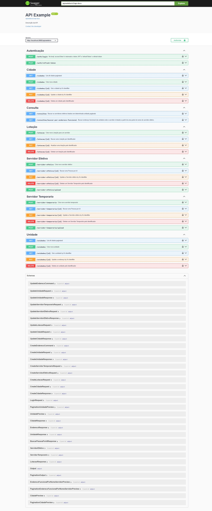

# Inscrição do candidato:

### Número da inscrição:
### CPF: 023.127.121-21
### Perfil: DESENVOLVEDOR JAVA (BACK-END) - SÊNIOR
### Contato: (65) 992461402

# Projeto: Sistema de Gestão com Clean Architecture

Este projeto é uma aplicação desenvolvida com **Spring Boot** utilizando **Java 17**, seguindo os princípios de **Clean Architecture** e **DDD**. Ele integra tecnologias modernas como **MinIO**, **PostgreSQL** e **NGINX** para oferecer uma solução robusta e escalável.

---

## Tecnologias Utilizadas

- **Spring Boot** com Java 17
- **MinIO**:latest
- **PostgreSQL**:latest
- **NGINX**:latest

---

## Como Executar

1. Navegue até a pasta `sandbox` no projeto.
2. Execute o seguinte comando no terminal dentro dessa pasta:

   ```bash
   docker-compose up
   ```

   Este comando iniciará os seguintes containers:
    - MinIO
    - PostgreSQL
    - NGINX
    - Aplicação Spring Boot

---

## Arquitetura da Solução

A aplicação utiliza **NGINX** como proxy reverso para resolver problemas de geração de links temporários no **MinIO**. 


